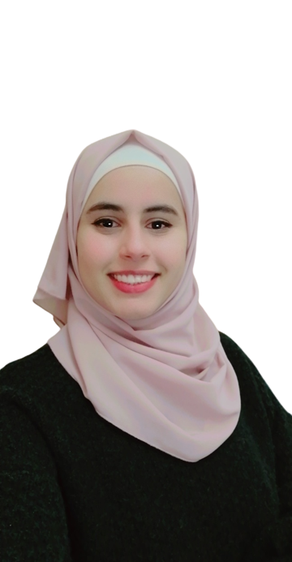

# Motivation lette

## My name is Walaa' Atiyh.

  ###  I'm Walaa' Atiah. Software developer engineer, I graduated from the Electrical Engineering Department of the University of Jordan and I follow my dream of becoming a software developer by studying the “Software Development - Python” course  at Luminus Technical University, I motivation person to learn a new concepts and improving my skills ,in fact Iam looking for a peaceful and professional working environment to upgrade my skills and do my best.💜",

### My graduation project is about study the ability to build floating photovoltaic system above king talal dam by using PVSYST and SKTCHUP programs and All the equations we need have been introduced into Microsoft Excel to calculate the amount of producing energy from the system in any region in the world.

### Also I have two years’ experience as estimation engineer in Efficiency for engineering and electrical equipment company ,where the work requires preparing document related to eligibility for bids , submission of bid in accordance with special conditions in the bid document ,preparing a record of the data and commitments related to the bid that well be participated in , Communicate with manufacturers and analyze specifications for electrical equipment and participate in the pricing process by assisting to engineer responsible for setting the overall and final prices for the bid item.

 
 

## This is my accounts.
[GITHUB link !](https://github.com/WalaaAtiah)

[facebook account !](https://www.facebook.com/people/%D9%88%D9%84%D8%A7%D8%A1-%D8%B9%D8%B7%D9%8A%D8%A9/100002134357943/)

[linkedin link !](https://www.linkedin.com/in/walaa-atiah-103aab209)

       